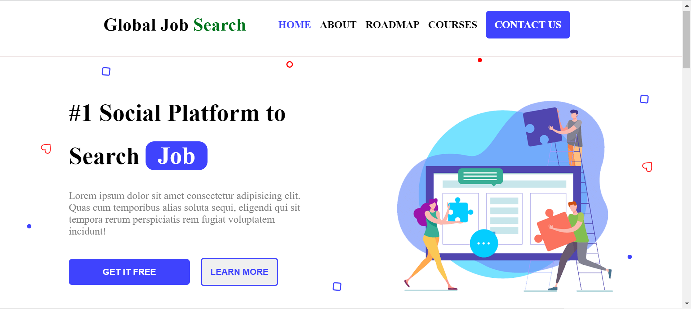

# Landing Page

Modern Landing Page Consists of About,Roadmap,Courses sections


## Preview




## Built With

 - HTML 
 - CSS
 - SCSS
 - Java Script
 - VS Code Editor

## Live

https://prakash-aathi.github.io/Landing-Page/

## Appendix

This is My First Project Using SCSS Without any built in frameworks.
## Authors

- [@prakash-aathi](https://github.com/prakash-aathi)


## Future optimizations

- Implement JS and more animations
- Implement Backend with using Micro Framework Flask


## Contributing

Contributions are always welcome!

See `contributing.md` for ways to get started.

Please adhere to this project's `code of conduct`.


## Deployment

- First, ensure that node.js & npm are both installed. If not, choose your OS and installation method 
- To deploy this project run

```bash
  npm run deploy
```


## Features

- Responsive
- Live previews
- Fullscreen mode
- Auto Scroll


## Installation

Install my-project with npm

```bash
  npm install my-project
  cd my-project
```
    
